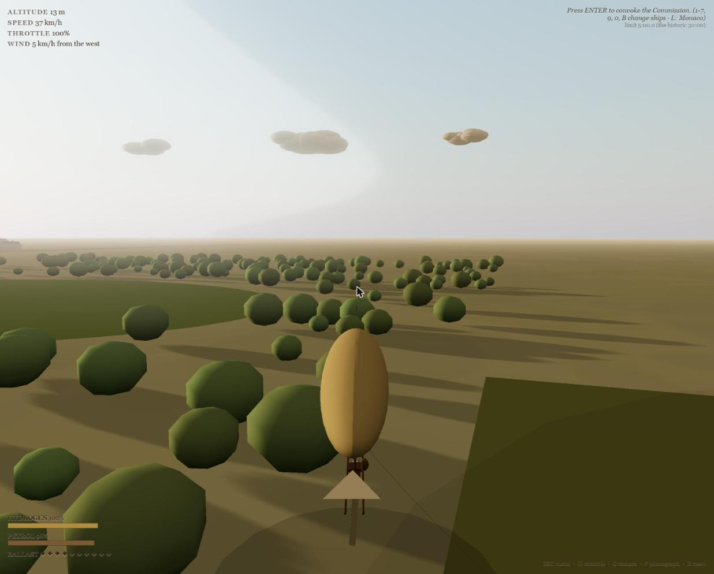
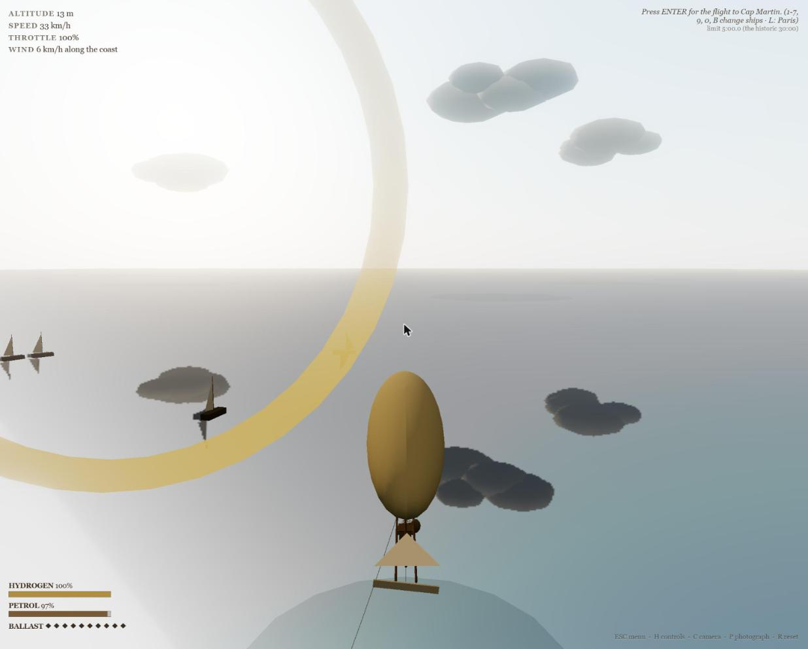

# My Airships ✈️🎈

**Fly Alberto Santos-Dumont's dirigibles over 1901 Paris — a browser flight game built
from his 1904 memoir, *My Airships*.**

**▶ Play it here: https://myairships.com** — no install, just a modern browser.
On a telephone, add it to your Home Screen and it runs without the browser's bars.



Before the Wright brothers were famous, a small Brazilian in a Panama hat was flying
petrol-engined balloons around the Eiffel Tower and parking them at his own front door on
the Champs-Élysées. This game is his memoir made playable: every ship, every mechanic, and
every hazard comes from the book (Project Gutenberg [#42344](https://www.gutenberg.org/ebooks/42344),
public domain).

## The game

- **Win the Deutsch Prize**: St. Cloud → round the Eiffel Tower → home, against the clock —
  the race he won on 19 October 1901 with 29 seconds to spare.
- **Winter in Monaco**: launch from the aerodrome of La Condamine and run the coast to
  Cap Martin — eleven kilometres there and back — guide-roping low over the waves. Don't
  put her in the bay.
- **St. Louis, 1904**: the World's Fair grand prize that never happened — his proposed
  triangular pylon course, flown against rival dirigibles (Deutsch's *La Ville de Paris*
  among them).
- **Eight historical scenarios** (Esc menu): the No. 1's fold and the kite-boys' rescue,
  the No. 5's crash onto the Trocadéro roof, the Deutsch Prize run, landing the No. 9 at
  his own door, Monaco's fatal 14th of February — flown better — the $100,000 race, the
  head-wind struggle that ended in Rothschild's tallest chestnut, and the 14th of July
  review flown over the massed army at Longchamps.
- **Read the wind like a pilot**: currents veer and strengthen with altitude ("he can
  leave one current for another") — smoke, flags, trees, water, and clouds each show a
  different layer of the sky. The crew will also tow your ship by its guide rope to
  period destinations.
- **Time trials — the aerial gymkhana** ("Ten times in succession I made the circuit of
  Longchamps"): lap circuits through the Grande Roue, under the Arc de Triomphe, over
  the bay, and threading the Observation Wheel. Instant restart on Enter, per-gate split
  times, and a **ghost** of your best run to race against — copy its code and send it to
  a friend to race asynchronously. Dives trade altitude for speed; times are kept per
  ship class. A **track editor** (G drops a gate) lets you build and share circuits, and
  the **weather is the same for everyone, everywhere, at the same moment** — the
  day's wind, where every cloud sits, the gusts, the thermals and the motor's own caprice
  are all functions of the clock (UTC), not of when you opened the page.
- **World records**: every personal best is entered in a public ledger, and the record
  to beat is in front of you while you fly — named on the HUD as you start a lap, beside
  every course in the menu, and announced when you take it. Boards run per course and
  ship class, with a daily board on today's seeded wind, and the record-holder's ghost
  can be downloaded and chased. Submitted runs are scrutineered on the server against the
  course geometry and the ship's own physics before they reach the ledger. It is optional:
  configure nothing and the feature simply doesn't exist — see [docs/ONLINE.md](docs/ONLINE.md).
- **Report a fault**: the beetle button above the menu sends the works an account of what
  went wrong, with a picture — the view, the whole window if you let the browser ask you
  which to share, or **one from your own camera roll**, which on a telephone is the only
  way to show a fault in the instruments or the menus — and the state you were flying in:
  ship, place, course, room, instruments, and anything the page threw. Part of the same optional wiring: with no
  Supabase project configured there is nowhere to send one, so the button is never built.
- **Fly together**: a room is a shared sky. Open one and it is listed for anyone to join —
  or open a **private** one, which stays off the list and lets in only the code you hand
  out. Either way the code is the whole address: give it to a friend and they land in your
  sky without being asked which trial you are flying. Everyone flies free in the same city,
  seeing the others where they actually are — their own ship class, their screw turning at
  their throttle, their rudder over as they turn — with an **arrow and a range** to each
  rival in the roster, turning with your own head so straight up is dead ahead. The host
  sets the course and calls the room away on one countdown, everyone abeam on a starting
  grid; if the host leaves, the room passes to the longest-standing pilot and stays as it
  was — listed or private. Every gate pass is called, so the panel keeps a running order
  and you can watch the lead change. Ships bump: silk grinds on silk and the gas hisses
  away, but nobody is wrecked by another pilot's lag. Not flying? Stand down and ride with
  any pilot in the room — chase, postcard, or standing in their basket.
- **Fly the whole fleet** — each ship handles like the book says it did:

| Ship | Character |
|---|---|
| The "Brazil" | spherical balloon — no motor, no rudder; drift, ballast, and the guide rope |
| No. 1 – No. 2 | long fragile cylinders that fold "like a pocket knife" when starved of gas |
| No. 3 | the big-bellied one on a bamboo pole keel — slow but unfoldable |
| No. 4 | the bicycle-saddle ship with the bow propeller |
| No. 5 | first pine-truss keel… and the weak valve that wrecked it |
| No. 6 | the Deutsch Prize winner — balanced and honest |
| No. 7 | the racer: 60 hp, two propellers, ~70 km/h |
| No. 9 | the beloved runabout — an egg driven thick end first, lands in streets |
| No. 10 | "The Omnibus" — twelve passengers, turns like a steamer |



## How it flies (the book's own physics)

- **"To descend without sacrificing gas and to mount without sacrificing ballast."**
  Hydrogen and sand are permanent spends; the skilled way to climb and dive is the
  *shifting weights* plus the propeller — free diagonal flight.
- **The helm is a bar, not a wheel**: pivoted at its middle, a cord from each end running
  aft to its own side of the rudder. Push one hand away and pull the other back and she
  comes round. The English memoir says "steering wheel" once; the French says *le
  gouvernail*, describes the No. 4's control as "le guidon de la bicyclette, relié au
  gouvernail", and has the rudder worked by cords throughout — the evidence is set out in
  [docs/HELM.md](docs/HELM.md).
- **The guide rope** trails beneath you: fly low and it grounds itself, automatically
  steadying your altitude (over water it is perfect). It also drags like a brake, drapes
  over rooftops, and snags.
- **Wind is a river**, strongest aloft: ride it high downwind, crawl home low against it.
- **Watch the envelope**: cloud shadow and the cool air over forests shrink the gas; a
  sagging envelope at full throttle lets the propeller eat the suspension wires; climb too
  fast and the valves vent your precious hydrogen. Petrol runs out too — then you are a
  free balloon.
- The motor is **capricious**. When it sputters, work the spark lever (tap F).

## Controls

Press **Esc** for the menu (choose ship and location), **H** for the key reference.

| Key | Action |
|---|---|
| W / S | throttle · A / D rudder · Q / E shifting weights (nose down / up) |
| SPACE | drop a ballast sack · V (hold) vent hydrogen · F coax the motor |
| ENTER | start the timed trial, near the gold ring |
| C | camera: chase / **aboard the basket** / postcard / vista |
| 1–7, 9, 0, B | change ships — **in the air** in free flight (she is taken over where she flew); land first during a scenario or trial |
| P | photograph mode (sepia + grain) · M sound · R reset |

## Run locally

Any static server from the repo root, then open the page:

```
python -m http.server 8140    # → http://localhost:8140/
```

Uses [three.js](https://threejs.org/) from a CDN import map — no build step, no
dependencies. Keep the tab focused; browsers pause background tabs.

Optional online leaderboards need a free Supabase project and two keys —
[docs/ONLINE.md](docs/ONLINE.md) walks through it, including deploying the
server-side run validator. To check that validator after any change to the
courses, ships, or its own rules:

```
node supabase/test-anticheat.mjs     # honest runs accepted, ten forgeries refused
```

## Where the cities came from

Nothing is placed by eye. Both cities are at **full scale** — a game metre is a
metre — and everything in them comes through one projection and one table of real
coordinates.

**Paris** is `src/paris_geo.js` (the Eiffel Tower as the anchor) and
`src/paris_streets.js`, 336 OpenStreetMap ways screened to 1901.

**Monaco** is `src/monaco_geo.js`: the ground is NASA's SRTM by way of the AWS
terrain tiles, on a 50 m grid, and it is the actual mountain — Mont Agel comes out
at 1093 m against a surveyed 1085, the Trophy of Augustus at 487 against 480. The
streets are 340 OpenStreetMap ways screened to 1902. The coast is *not* today's
coast: Fontvieille, the Larvotto beaches, the outer digue and Mareterra are all
made ground poured into the sea long after 1902, and they are masked back to
water.

The generators live in [`tools/`](tools/) and the method — including what the
modern data gets wrong for 1902, and how it was checked — is written up in
[`docs/PERIOD_NOTES.md`](docs/PERIOD_NOTES.md).

## The source material

`docs/BOOK_REFERENCE.md` is the design bible: a catalogue of the memoir's locale
descriptions, handling passages, and per-ship specifications — each quoted and mapped to
the graphics or physics rule it drives. Read it with the book at
[gutenberg.org/ebooks/42344](https://www.gutenberg.org/ebooks/42344).

*"Por ceos nunca d'antes navegados!"* — Through skies never before sailed.
(Camões' line, altered by one word, as it flew on his airship's streamer.)

## Credits & license

Code: MIT. Text quotations and historical details from Alberto Santos-Dumont,
*My Airships* (1904), public domain. Built with three.js.
